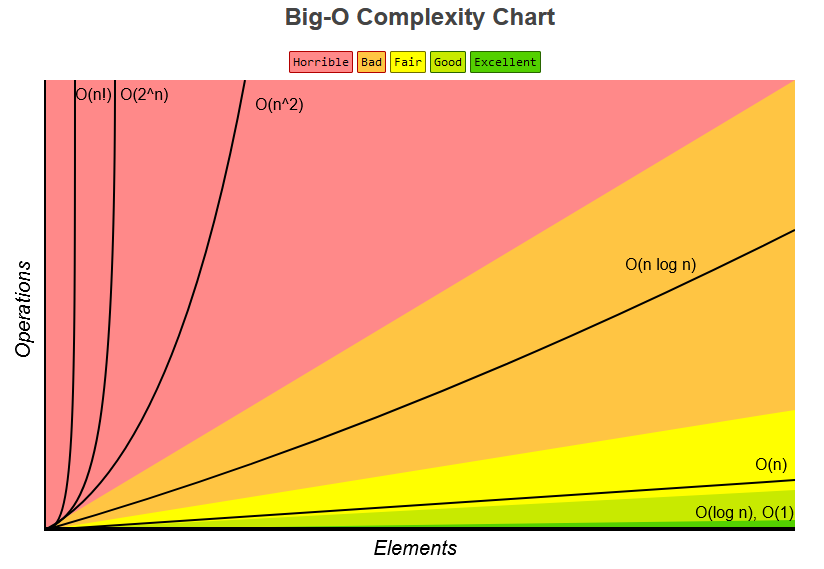

# Big O

**Different Big Os**:

- `O(1)` - **Constant**: no loops.
- `O(n)` - **Linear**: for loops, while loops through n items.
- `O(log N)` - **Logarithmic**: usually searching algorithms have log n if they are sorted (Binary Search).
- `O(n log(n))` - **Log Linear**: usually sorting operations.
- `O(n^2)` - **Quadratic**: every element in a collection needs to be compared to ever other element. Two nested loops.
- `O(2^n)` - **Exponential**: recursive algorithms that solves a problem of size N.
- `O(n!)` - **Factorial**: you are adding a loop for every element.\
**Iterating through half a collection is still O(n).**\
**Two separate collections: O(a * b).**

**What can cause time in a function?**:

- *Operations*: (`+`, `-`, `*`, `/`)
- *Comparison*: (`<`, `>`, `==`)
- *Looping*: (`for`, `while`)
- *Outside Function call*: (`function()`)

**Rule Book**:

1. Always worst Case
2. Remove Contants
3. Rules:
    - Different inputs should have different variables: `O(a + b)`
    - A and B arrays nested would be: `O(a * b)`
4. Drop Non-dominant terms

**What Causes Space Complexity?**:

- `Variables`
- `Data Structures`
- `Function Call`
- `Allocations`

> Information from `ZTM`

## Complexity Chart

