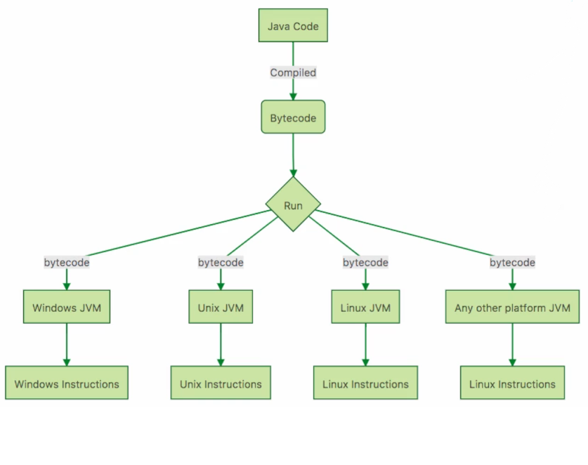

# Java Platform

## Platform Independent

How do we write once and run in every Operating System?

> **Bytecode**: Intermediate Representation
Then afterwards, the **Bytecode** would be process by **JVM** to convert it into executable instruction for it's Operating System.

What happens during *Execution* and *Compilation* Time?

> During Execution, the **JVM** is used. During Compilation, Java Code is being compiled to **Bytecode**

## JDK vs JRE vs JVM
