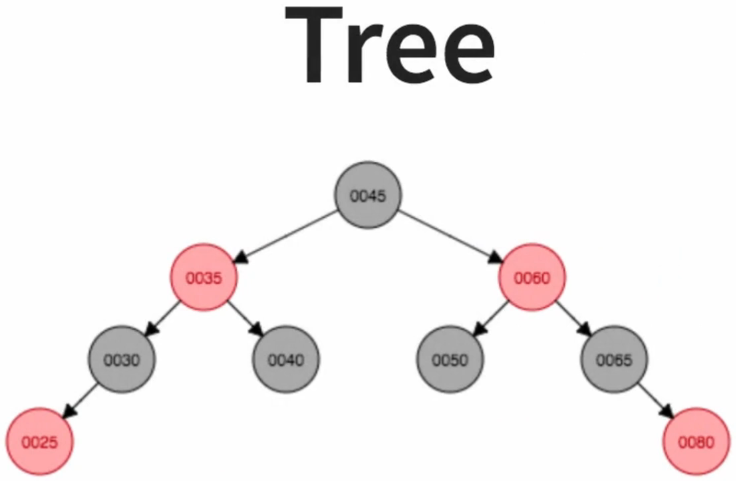

# Collections Framework

- Compared to primitive types, in `Collections` the method to get the length of the `List` for example is using the method `size()`.

Common Types:

- [List Interface](#list-interface)
- [Set Interface](#set-interface)
- [Queue Interface](#queue-interface)
- [Map Interface](#map-interface)

## List Interface

Overview:

- `Ordered` Collection.
- Allows `duplicate` elements.
- Think of it like an `Array`.
- `List.of()` creates an immutable `List`.
  - Use `ArrayList`, `LinkedList`, `Vector` to make mutable `List`.

```Java
interface List<E> extends Collection<E>{
    boolean addAll( int paramlnt, Collection<? extends E> paramComparator);
    E get(int position);
    E set(int position, E paramE);
    void add(int position, E paramE);
    E remove(int paramlnt);
    int indexOf(Object paramObject);
    int lastIndexOf(Object paramObject);
}
```

- `Implementation`:

```Java
// Initialise a List
List<String> words = List.of("Apple", "Bar", "Cat");

// Get the Size of the List.
words.size();
```

### ArrayList vs LinkedList vs Vector

We use `ArrayList` if:

- We want to access have `Constant Time - O(1)` access of the Array.
- `Insertion` and `Deletion` are slower compared to `LinkedList`.

We use `LinkedList` if:

- We want faster `Insertion` and `Deletion`.
- Able to implement `Double LinkedList`
- `Iteration` is slower than `ArrayList`.

We use `Vector` if:

- We want `Thread Safe - Synchronized Methods`.
- We want almost `Constant Time - O(1)` access of an Array.

### ArrayList Operations

- Adding Element(s) in `ArrayList`:

```Java
ArrayList<String> listOfAnimals = new ArrayList<>();
```

- `Add` element at the end of the `Array`:

```Java
listOfAnimals.add("Elephant");
listOfAnimals.add("Lion");
listOfAnimals.add("Fish");
```

- `Add` element based on their `Index`:

```Java
listOfAnimals.add(1, "Dog");
```

- `Add` List to an ArrayList:

```Java
List<String> newList = List.of("Yak", "Zebra");
listOfAnimals.addAll(newList);
```

- Changing Element in `ArrayList`:

```Java
listOfAnimals.set(1, "Cat");
```

- Removing Element in `ArrayList`:

```Java
listOfAnimals.remove("Fish");
listOfAnimals.remove(0);
```

- Getting the `indexOf` the element:

```Java
// Index of element
listOfAnimals.indexOf("Yak");
// Last Index of the elment
listOfAnimals.lastIndexOf("Yak");
```

### Iterations for ArrayList

There are multiple ways to `Iterate` around an `ArrayList`

- `(Regular) For Loop`:

```Java
for (int i = 0; i < listOfAnimals.size()>;i++){
    System.out.println(listOfAnimals.get(i));
}
```

- `(Enhanced) For Loop`.
  - **Not Recommended** to use it when there you want to make a `Modification`, especially when you want to `remove`, for the `Element`.
  - Use an `Iterator` when there is a modification.

```Java
for (String animal : listOfAnimals){
    System.out.println(animal);
}
```

- `Iterator Class`:

```Java
Iterator<String> animalIterator = listOfAnimals.iterator();

while(animalIterator.hasNext()){
    System.out.println(animalIterator.next());
}
```

- For `Collection Streams`, go look at the section on `Functional Programming & Lambda`.

### Sorting

The most popular for sorting a simple `ArrayList`:

```Java
ArrayList<Integer> newNumberList = new ArrayList<>(5, 31, 22, 2, 3, 69, 25);
// sort() is a static method
Collections.sort(newNumberList);
```

- If we want to sort `Objects`, we would use a `Comparable Interface`:

```Java
// Student Class
public class Student implements Comparable<Student>{
    private int id;
    private String name;

    // Constructor
    public Student(int id, String name){
        this.id = id;
        this.name = name;
    }

    // Getter
    public int getId(){
        return this.id;
    }
    public String getName(){
        return this.name;
    }

    // Setter
    public void setId(int id){
        this.id = id;
    }
    public void set(String name){
        this.name = name;
    }

    // Comparable Interface - Sorting them in Acsending order
    @Override
    public int compareTo(Student that){
        return Integer.compare(this.id, that.id);
    }
}

// In main()
void main(){
    List<Student> studentsList = List.of(new Student(1, "Thomas"), new Student(57, "Ranger"), new Student(3, "John"));
    Collections.sort(studentsList);
}
```

- To use `Ascending` or `Descending` sort, we would create their own `Class`:

- `Ascending`:

```Java
class AscComp implements Comparator<Student> {
    @Override
    public int compare(Student student1, Student student2){
        return Integer.compare(student1.getId(), student2.getId());
    }
}
```

- `Descending`:

```Java
class DescComp implements Comparator<Student> {
    @Override
    public int compare(Student student1, Student student2){
        return Integer.compare(student2.getId(), student1.getId());
    }
}
```

- `main` method:

```Java
void main(){
    // Sorting studentList in Ascending Order
    studentsList.sort(new AscComp());

    // Sorting studentList in Descending Order
    studentsList.sort(new DescComp());
}
```

## Set Interface

- `Unique` things only - Does not allow duplication.
- `Set` interface extends to `Collection`.
- `Set.of()` creates immutable `Sets`.
  - Use `HashSet` or `TreeSet` for mutable `Sets`.

```Java
interface Set<E> extends Collection<E>{
    boolean addAll( int paramlnt, Collection<? extends E> paramComparator);
    E get(int position);
    E set(int position, E paramE);
    void add(int position, E paramE);
    E remove(int paramlnt);
    int indexOf(Object paramObject);
    int lastIndexOf(Object paramObject);
}
```

- `Implementation`:

```Java
Set<String> set = Set.of("Apple", "Banana", "Cat");
```

### Tree (sub-section)

A `Tree` data structure is a good way to `Insert`, `Delete` and `Search` in a sorted way.



We can search the `smallest value` by going all the way to the `left side` of the tree and `largest value` by going all the way to the `right side` of the tree.

### HashSet vs LinkedHashSet vs TreeSet

- `HashSet`:
  - When we initialise a `new HashSet<>();` and add elements into it, the elements would be in a random order
  - **`Random Order`**.
  - Most Efficient.
- `LinkedHashSet`:
  - When we add elements into a `LinkedHashSet`, the elements in the set would be stored in order in which it's `inserted`.
  - **`Insertion Order`**.
- `TreeSet`:
  - Elements added in `TreeSet` will be in a sorted order.
  - **`Sorted Order`**.

> All sets cannot have duplicate elements.

### Operations of TreeSets

`TreeSet` implements `Navigable`:

```Java
TreeSet<Integer> numbers = new TreeSet<>(Set.of(65, 54, 34, 12, 99));
// -> [12, 34, 54, 65, 99]
```

- `Lower` or `Floor`:

```Java
numbers.floor(40);
numbers.lower(34);
```

- `Higher` or `Ceiling`:

```Java
numbers.ceiling(36);
numbers.higher(36);
```

- `Subset` => number between (x, y):

```Java
numbers.subSet(20, 80); //(20, 80) -> (x, y)
numbers.subSet(34, true, 65, true); // (x >= 34 && y <= 65)
```

- `headSet` and `tailSet`:

```Java
numbers.headSet(50); // All numbers up to 50
numbers.tailSet(50);// All numbers beyond 50
```

## Queue Interface

`Queue` sorts elements in a `Sorted Natural Order`.

There are many different methods of `Queue`:

```Java
interface Queue<E> extends Collection<E>{
    // All previous methods
    boolean addAll( int paramlnt, Collection<? extends E> paramComparator);
    E get(int position);
    E set(int position, E paramE);
    void add(int position, E paramE);
    E remove(int paramlnt);
    int indexOf(Object paramObject);
    int lastIndexOf(Object paramObject);
    // Queue Additional methods
    boolean add(E paramE) ;
    boolean offer(E paramE) ;
    E remove() ;
    E poll();
    E peek();
}
```

- `Implementation`:

```Java
Queue<String> queue = new PriorityQueue<>();
```

### Queue Operations

- `Adding` elements:

```Java
queue.offer("Apple");
queue.addAll(List.of("Zebra", "Monkey", "Cat"));
```

- `Polling` (Removing Element, `FIFO`):

```Java
queue.poll();
// Removes Apple, first element
```

### Making Custom Order

We can make a custom `Queue` order by implementing a `Comparator Interface`.

- Like in the `ArrayList`, we want to implement `Queue` in an `ASC` order:

```Java
class StringLengthComparator implements Comparator<String>{
    @Override
    public int compare(String value1, String value2){
        return Integer.compare(value1.length(), value2.length());
    }
}
```

- `Queue` in an `DESC` order:

```Java
class StringLengthComparator implements Comparator<String>{
    @Override
    public int compare(String value1, String value2){
        return Integer.compare(value2.length(), value1.length());
    }
}
```

- Parse it into `initialisation`:

```Java
Queue<String> queue = new PriorityQueue<>(new StringLengthComparator());
```

## Map Interface

- `Key` - `Value` Pair.
- Think of it like `Dictionary` in `Python`.
- `Essentials`:

```Java
interface Map<L, V>{
    int size();
    boolean isEmpty() ;
    boolean containsKey(Object paramObject) ;
    boolean containsVa1ue(Object paramObject) ;
    V get (Object key) ;
    V put (K key, V value) ;
    V remove (Object key) ;
    void putAll (Map<? extends K,? extends V> paramMap);
    void clear() ;
    Set<K> keyset() ;
    Collection<V> values() ;
    Set<Entry<K,V>> entrySet( ) ;
    boolean equals (Object paramObject)
}
```

### HashMap vs LinkedHashMap vs HashTable vs TreeMap

- `HashMap`:
  - unsorted, unordered
  - key's hashcode() is used

```Java
class HashMap implements Map{
}
```

- `Hashtable`:
  - Synchronized - ==Thread Safe== - Version of `HashMap`
  - unsorted, unordered
  - key's hashcode() is used
  - `HashMap` allows a key with `null` value. `Hashtable` doesn't. (==Interview Question==)

```Java
class Hashtable implements Map{
}
```

- `LinkedHashMap`:
  - `Insertion order` is maintained
  - ==Slower== `insertion and deletion`
  - ==Faster== `iteration`

```Java
class LinkedHashMap implements Map{
}
```

- `TreeMap`:
  - `Sorted order` is maintained
  - Implements `NavigableMap`

```Java
class TreeMap implements Map, NavigableMap{
}
```

### Map Operations

- `Initilised`:

```Java
Map<String, Integer> map = Map.of("A", 3, "B", 5, "Z", 10);
```

- `Get` value:

```Java
map.get("Z")
// 10
```

- `Size` of the `HashMap`:

```Java
map.size()
// 3
```

- `isEmpty`:

```Java
map.isEmpty()
// false
```

- Contains a `key`:

```Java
map.containsKey("A");
// true
map.containsKey("F");
// false
```

- Contains a `value`:

```Java
map.containsValue(3);
// true
```

- Retrieve `keys`:

```Java
map.keySet();
// [Z, A, B]
```

- Retrieve `values`:

```Java
map.values();
// [10, 3, 5]
```

#### HashMap Operations

- `Initialise`:

```Java
Map<String, Integer> map = new HashMap();
// or
Map<String, Integer> map = new HashMap(map);
```

- `Add` elements into `HashMap`:

```Java
map.put("F", 5);
// Adding value
map.put("Z", 11);
// Editing value from 10 to 11
```

#### TreeMap NavigableMap

```Java
Map<String, Integer> map = Map.of("A", 15, "B", 25, "F", 25, "Z", 5, "G", 25, "L", 250);

Map<String, Integer> treeMap = new HashMap(map);
// { A=15 B=25 F=25 G=25 L=250 Z=5}
```

- `Higher` than the value of the `key`:

```Java
treeMap.higherKey("B");
// "F"
```

- `Greater than or Equals, >=` to the `key`:

```Java
treeMap.ceilingKey("B");
// "B"
```

- `Lower` than the value of the `key`:

```Java
treeMap.lowerKey("B");
// "A"
```

- `Lower than or Equals, <=` to the `key`:

```Java
treeMap.floorKey("B");
// "B"
```

- `First` element:

```Java
treeMap.firstEntry();
// A=15
```

- `Last` element:

```Java
treeMap.lastEntry();
// Z=5
```

- `SubMap` or `Slicing` => element between (x, y):

```Java
treeMap.subMap("C", "Y");
// {F=25, G=25, L=250}
treeMap.subMap("B", "Z");
// {B=25, F=25, G=25, L=250} => exclude y, which is "Z"
treeMap.subMap("B", true, "Z", true);
// {B=25, F=25, G=25, L=250, Z=5} => includes Z
```
