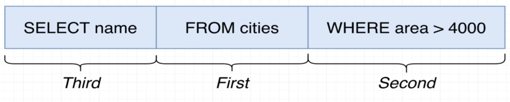

# Basic SQL

Sections:

- [`Creating Table`](#creating-table)
- [`Inserting values into the table`](#inserting-values-into-the-table)
- [`Math Operations`](#math-operations)
- [`String Operations`](#string-operations)
- [`Query`](#query)
- [`Update Row`](#update-row)
- [`Delete`](#delete)
- [`End`](#end)

## Creating Table

To create a table:

`Format`:

```sql
CREATE TABLE <table_name> (
    <attribute_1> <type>
    <attribute_2> <type>
    <attribute_3> <type>
)
```

`Example`:

```sql
CREATE TABLE IF NOT EXISTS cities (
    name VARCHAR(50),
    country VARCHAR(50),
    population INTEGER,
    area INTEGER
)
```

## Inserting values into the table

To insert values into the table

### Verbose

`Format`:

```sql
INSERT INTO <table_name> (COLUMN_1, COLUMN_2, COLUMN_3, ...COLUMN_N)
VALUES ();
```

`Example`:

```sql
INSERT INTO cities (name, country, population, area)
VALUES 
    ('Tokyo', 'Japan', 1234567, 2243),
    ('Delhi', 'India', 1234567, 6728),
    ('Texas', 'USA', 29387728, 2937);
```

### Not Verbose

`Format`:

```sql
INSERT INTO <table_name>
VALUES ();
```

`Example`:

```sql
INSERT INTO cities
VALUES 
    ('Tokyo', 'Japan', 1234567, 2243),
    ('Delhi', 'India', 1234567, 6728),
    ('Texas', 'USA', 29387728, 2937);
```

## Math Operations

- **Add**: `+`
- **Subtract**: `-`
- **Multiply**: `*`
- **Division**: `/`
- **Exponent**: `^`
- **Square Root**: `|/`
- **Absolute Value**: `@`
- **Remainder**: `%`

`Format`:

```sql
SELECT <column> <operand> <column> AS <new_column_name> FROM <table_name>;
```

`Example`:

```sql
SELECT name, population / area AS population_per_area FROM cities;
```

### Comparison

For the [WHERE](#query) conditions

- **Values Equal**: `=`
- **Left Greater than Right**: `>`
- **Left Smaller than Right**: `<`
- **Left Greater than or equals to Right**: `>=`
- **Left Smaller than or equals to Right**: `<=`
- **Present in the list**: `IN`
- **Not Present in the list**: `NOT IN`
- **Between two value**: `BETWEEN`
- **Not Equal**: `<>`
- **Not Equal**: `!=`

`Format`:

```sql
SELECT <columns>
FROM <table_name>
WHERE <conditions>
```

`Example`:

- Between

```sql
SELECT name, area
FROM cities
WHERE area BETWEEN 2000 AND 4000
```

- In and Not In

```sql
SELECT name, area
FROM cities
WHERE area IN ('Delhi', 'Tokyo');
```

## String Operations

- **Join two strings**: `||`
- **Concatenate**: `CONCAT()`
- **Lower**: `LOWER()`
- **Upper**: `UPPER()`
- **Length**: `LENGTH()`

`Format`:

```sql
SELECT Function(<column>) AS <new_column_name> FROM <table_name>;
```

`Example`:

```sql
SELECT UPPER(CONCAT(name, ', ', country)) AS location FROM cities;
```

## Query

How `PostgreSQL` use our statement to query:



1. `FROM` the datasource
2. `WHERE` conditions to query
3. `SELECT` which column from the data source

`Format`:

```sql
SELECT <column>  
FROM <table_name> 
WHERE <conditions>;
```

`Example`:

```sql
SELECT name
FROM cities
WHERE areas > 4000;
```

### Math Operations (For WHERE)

We can use the math operations:

`Example`:

```SQL
SELECT name, area
FROM cities
WHERE population / area > 1000;
```

## Update row

Updating the entry in the table:

`Example`

```SQL
UPDATE <table>
SET <value>
WHERE <condition>
```

`Format`

```SQL
UPDATE cities
SET population = 9999999
WHERE name = 'Tokyo';
```

## Delete

`Example`

```SQL
DELETE FROM <table>
WHERE <condition>
```

`Format`

```SQL
DELETE FROM cities
WHERE name = 'Tokyo';
```

## End

Next Topic: [Topic 2 - Designing Database](2-Designing_Database.md)
