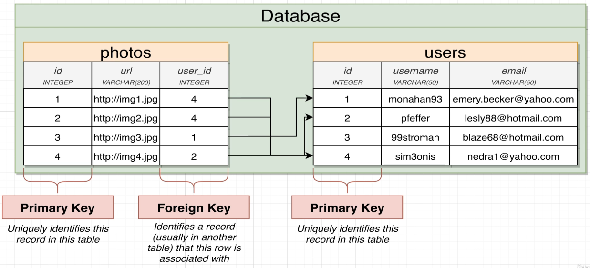

# Designing Database

## Relationships

There are 4 types of relationship:

- `One to Many`:
  - Think of it as the perspective of a woman
  - A woman can have many children
- `Many to One`
  - Think of it as the perspective of the children
  - A child have one birth mother
- `One to One`
  - Think of it from both perspective in a monogamy relationship
  - A man belongs/has a woman
  - A woman belongs/has a man
- `Many to Many`
  - Think of it from both perspective in a polygamy relationship
  - A man have many woman
  - A woman have many man

## Keys

Every table have at least a column called `Primary Key`. It's a unique identifier for an entry. It is also used to link one table to another, which will then be called `Foreign Key`.



### Auto-Incremental

To have `Auto-Incremental Primary Key`, we can use the keyword `Serial`:

`Example Primary Key`:

```SQL
CREATE TABLE users (
    id SERIAL PRIMARY KEY,
    name VARCHAR(50),
    email VARCHAR(50)
);
```
