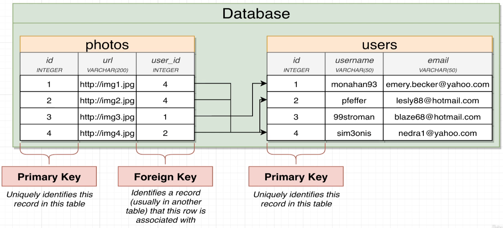

# Designing Database

## Relationships

There are 4 types of relationship:

- `One to Many`:
  - Think of it as the perspective of a woman
  - A woman can have many children
- `Many to One`
  - Think of it as the perspective of the children
  - A child have one birth mother
- `One to One`
  - Think of it from both perspective in a monogamy relationship
  - A man belongs/has a woman
  - A woman belongs/has a man
- `Many to Many`
  - Think of it from both perspective in a polygamy relationship
  - A man have many woman
  - A woman have many man

## Keys

Every table have at least a column called `Primary Key`. It's a unique identifier for an entry. It is also used to link one table to another, which will then be called `Foreign Key`.



### Auto-Incremental

To have `Auto-Incremental Primary Key`, we can use the keyword `Serial`:

`Example Primary Key`:

```SQL
CREATE TABLE users (
    id SERIAL PRIMARY KEY,
    name VARCHAR(50),
    email VARCHAR(50)
);
```

`Format Foreign Key`:

```SQL
CREATE TABLE photos (
    id SERIAL PRIMARY KEY,
    <foreign_key_name> <type> REFERENCES <foreign_table>(<column_name>)
);
```

`Example Foreign Key`:

```SQL
CREATE TABLE photos (
    id SERIAL PRIMARY KEY,
    url VARCHAR(200),
    user_id INT REFERENCES users(id)
);
```

## Joining Table

We can join 2 or more tables together based on their references. We can add the 2 keywords `JOIN` and `ON`:

`Format Join`:

```SQL
SELECT <column> 
FROM <Primary_table>
JOIN <Secondary_table> ON <Primary_table_column> = <Secondary_table_id>;
```

`Example Join`:

```SQL
SELECT * 
FROM photos
JOIN users ON photos.user_id = users.id;
```

## Deleting with Contraints

We can use contraints to alter the behaviour of our database table. When implementing the table, we can do as followed:

`Example`:

```SQL
CREATE TABLE IF NOT EXISTS <table> (
    id SERIAL PRIMARY KEY,
    <foreign_key_name> <type> REFERENCES <foreign_table>(<column_name>) ON DELETE <constraints>
);
```


