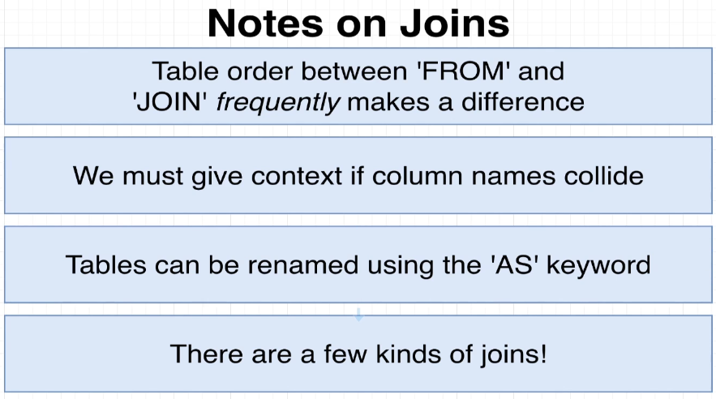
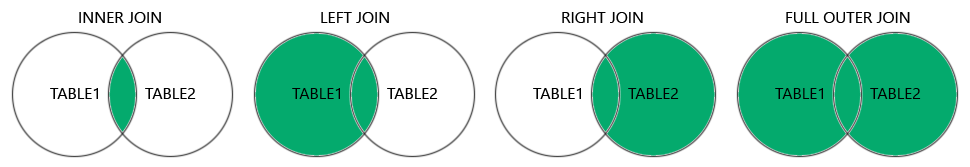
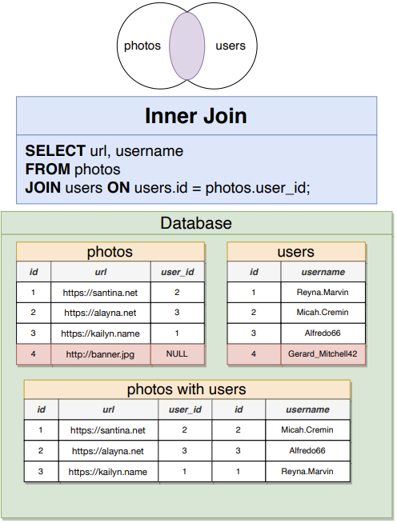
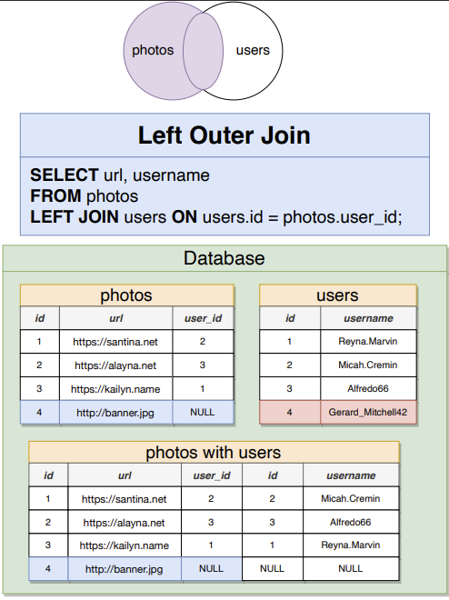
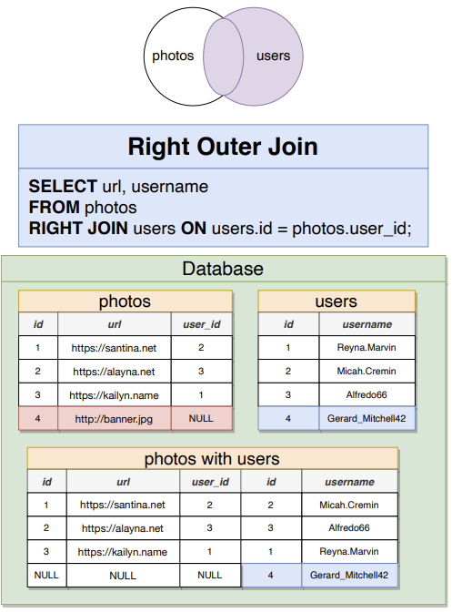
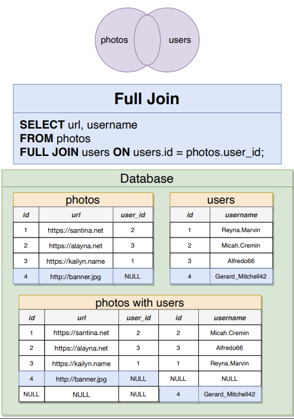

# A Comprehensive Join Documentation

## Some Notes on Joins



## Different Types of SQL Joining Table

Understanding the different joins would require `Set Theory` from Discrete Math. So it's highly recommended to understand `Set Theory` before trying to understand.

- **Intersect**: `INNER JOIN` [Jump to Section](#intersect-or-inner-join)
- **Primary Table Set with Intersect**: `LEFT JOIN` [Jump to Section](#primary-table-set-with-intersect-or-left-join)
- **Secondary Table Set with Intersect**: `RIGHT JOIN` [Jump to Section](#secondary-table-set-with-intersect-or-right-join)
- **Union**: `FULL JOIN` [Jump to Section](#union-or-full-join)


Diagram from [W3 SQL](https://www.w3schools.com/sql/sql_join.asp).

### `Intersect` OR `INNER JOIN`

By default, we're using `INNER JOIN` when using the keyword `JOIN`.


> **In this example**, since the database can't find any `NULL` user on the users table; The Database would discard the photos entry with a `NULL` reference value.

### `Primary Table Set with Intersect` OR `LEFT JOIN`

It is when the database outputs all the entries from the Primary Table using `LEFT JOIN`


> **In this example**, the Primary table is the `photos` with an entry with a reference value of `NULL`. The database would not discard the value rather, it would "append" a `NULL` entry.

### `Secondary Table Set with Intersect` OR `RIGHT JOIN`

The database would output all the entries from the Secondary table even when it doesn't have any entries in the primary table.


> **In this example**, the database output would output all entries on the Secondary table, the `users` table, and entries without a link; they will have a `NULL` entry appended to them when `JOIN`.

### `UNION` OR `FULL JOIN`

A `FULL JOIN` outputs all entries from both Primary and Secondary Tables.


> **In this example**, you can see that an entry from the Primary Table, `photos`, and an entry from the Secondary Table, `users`, have `NULL` entry appended next to them.

## Conditionals with Join

It's possible to filter out using the `WHERE` keyword when joining the tables.

`Example`:

```SQL
SELECT contents, url
FROM comments AS c
JOIN photos AS p ON c.photo_id = p.id
WHERE c.user_id = p.user_id;
```

## Three Way Join

It's possible to have a three way joins. By doing so, our second `JOIN` statement is going to be a more complicated expression.

`Example`:

```SQL
SELECT contents, url, username
FROM comments AS c
JOIN photos AS p ON c.photo_id = p.id
JOIN users ON users.id = c.user_id AND users.id = p.user_id;
```

> **In this example**, We want to see the `usernames` of the users who `comments` on their own `photos`.
