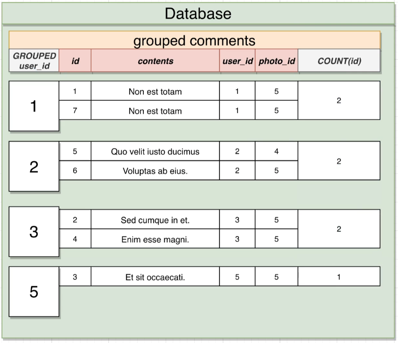
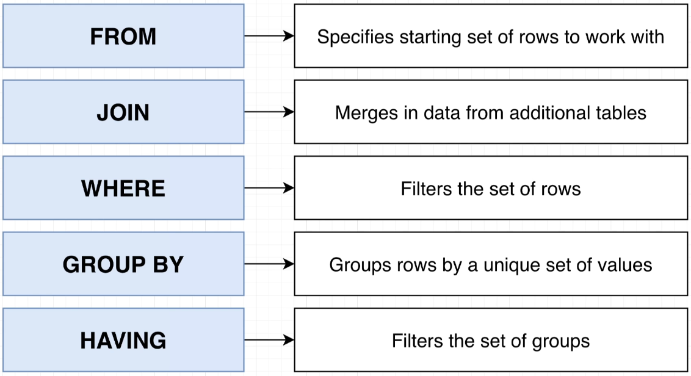

# Grouping and Aggregation

Sections:

- [`Overview`](#overview)
- [`Grouping`](#grouping)
- [`Aggregation`](#aggregation)
- [`Having`](#having-keyword)
- [`End`](#end)

## Overview

- `Grouping`:
  - Reduces many rows down to fewer rows.
  - Done by using the `GROUP BY` keyword.
  - Visualizing the result is key to use.

- `Aggregates`:
  - Reduces many value down to one
  - Done by using `aggregate functions`


## Grouping

`GROUP BY` finds all the set of `all unique entries in the queried columns` and then take each row and `assign it to a group` based on the column.

`Format`:

```SQL
SELECT <column>
FROM <table>
GROUP BY <column>;
```

`Example`:

```SQL
SELECT user_id
FROM comments
GROUP BY user_id;
-- GROUP BY <column> must be the same as the one in SELECT <column>
```


`Visualisation`:


## Aggregation

- `COUNT`: Returns the `number of values` in a group of values
- `SUM`: Finds the `sum` of a group of numbers
- `AVG`: Finds the `average` of a group of numbers
- `MIN`: Returns the `minimum value` from a group of numbers
- `MAX`: Returns the `maximum value` from a group of numbers


`Example`:

```SQL
SELECT AVG(id)
FROM comments
```

### Adding GROUP BY

`Example`:

```SQL
SELECT COUNT(id), user_id
FROM comments
GROUP BY user_id
```

`Visualisation`:


> **NOTE**: Corner cases for COUNT() exists. Read the next section for information.

#### COUNT corner case

`COUNT` doesn't count the entry with a null value. To counter this, use `COUNT(*)`.

`Example`:

```SQL
SELECT user_id, COUNT(*)
FROM comments
GROUP BY user_id
```

## HAVING Keyword

Much like `WHERE`, `HAVING` is usually group with `GROUP BY` (no pun intended). `HAVING` is more of a filter for set of groups while `WHERE` is filtering the set of rows.



**Example Question**:
Find the `number of comments` for each photo where the `photo_id is less than 3` and the `photo has more than 2 comments`

```SQL
SELECT photo_id, COUNT(*)
FROM comments
WHERE photo_id < 3
GROUP BY photo_id
HAVING COUNT(*) > 2;
```

## End

Previous Topic: [Topic 3 - Joins](3-Joins.md)

Next Topic: [Topic 5 - Sorting](5-Sorting.md)
