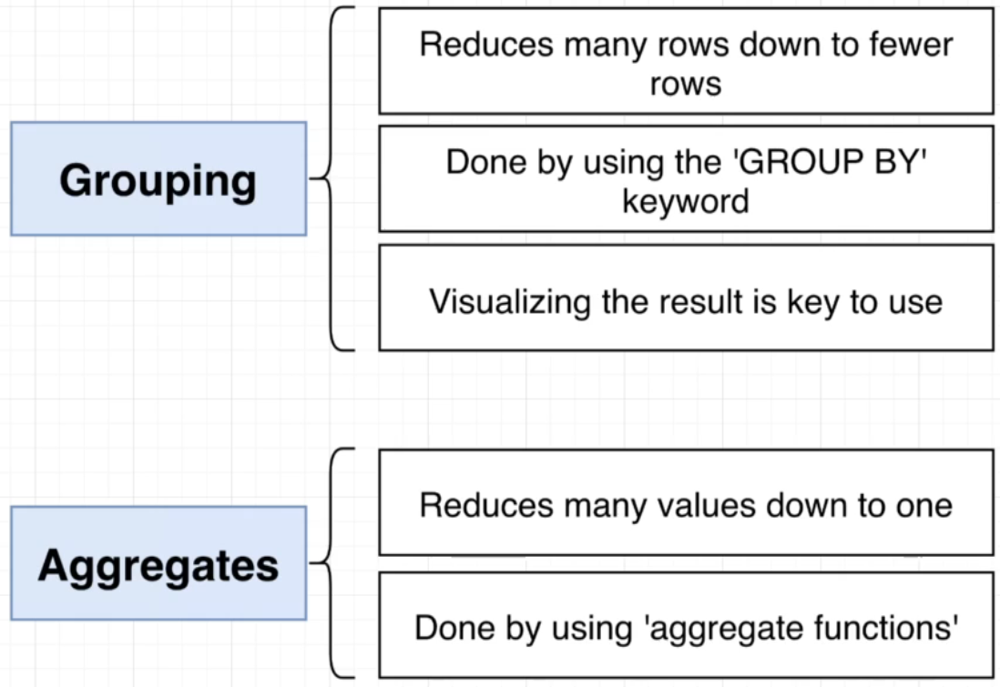
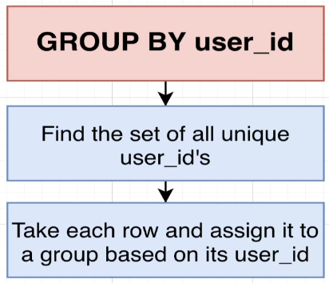
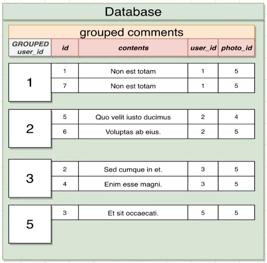
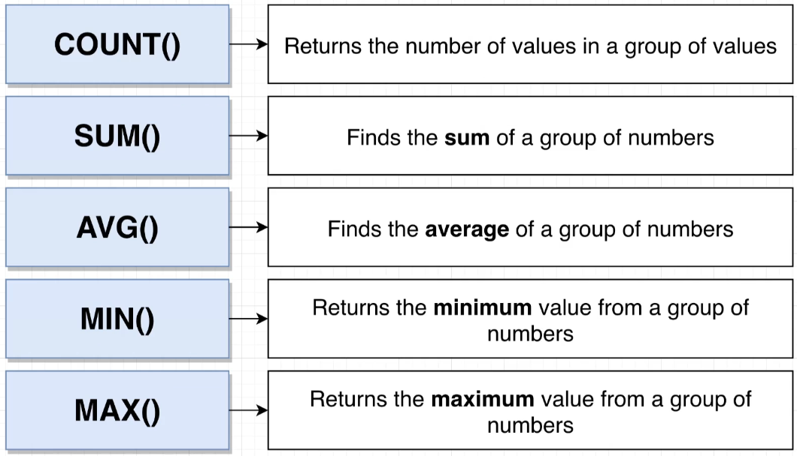

# Grouping and Aggregation

- Grouping:
  - Reduces many rows down to fewer rows.
  - Done by using the `GROUP BY` keyword.
  - Visualizing the result is key to use.

- Aggregates:
  - Reduces many value down to one
  - Done by using `aggregate functions`



## Grouping

`GROUP BY` finds all the set of `all unique entries in the queried columns` and then take each row and `assign it to a group` based on the column.

`Format`:

```SQL
SELECT <column>
FROM <table>
GROUP BY <column>;
```

`Example`:

```SQL
SELECT user_id
FROM comments
GROUP BY user_id;
-- GROUP BY <column> must be the same as the one in SELECT <column>
```


`Visualisation`:


## Aggregation

- `COUNT`: Returns the `number of values` in a group of values
- `SUM`: Finds the `sum` of a group of numbers
- `AVG`: Finds the `average` of a group of numbers
- `MIN`: Returns the `minimum value` from a group of numbers
- `MAX`: Returns the `maximum value` from a group of numbers



`Example`:

```SQL
SELECT AVG(id)
FROM comments
```

### Adding GROUP BY

`Example`:

```SQL
SELECT COUNT(contents), user_id
FROM comments
GROUP BY user_id
```