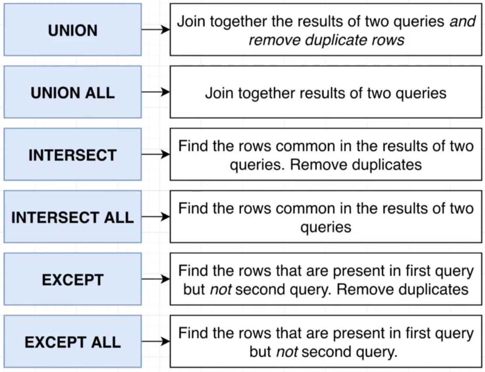

# Union and Intersection

- [`UNION`](#union) - Set Theory of `Union`. Include the whole of two table.
- [`INTERSECT`](#intersect) - Set Theory of `Intersect`. Include only the same value between two table.
- [`Except`](#except) - Set Theory of . Only Left Table without the intercept.



## UNION

We can get two results by using `UNION` keyword.

`Format`:

```SQL
(
SELECT <column>
FROM <table>
ORDER BY <column>
LIMIT <to_the_number_of_rows>
)
UNION
(
SELECT <column>
FROM <table>
ORDER BY <column>
LIMIT <to_the_number_of_rows>
)
```

`Example`:

```SQL
(
SELECT *
FROM products
ORDER BY price DESC
LIMIT 4
)
UNION
(
SELECT *
FROM products
ORDER BY price / weight DESC
LIMIT 4
)
```

> **In this example:** we're trying to find out the first four rows of the highest price **AND** the highest price per weight entries.

### Without removing duplicates

If we don't want to remove duplicates in our `UNION` query, we use the `ALL` keyword with `UNION`.

`Example`:

```SQL
(
SELECT *
FROM products
ORDER BY price DESC
LIMIT 4
)
-- Added the `ALL` keyword
UNION ALL
(
SELECT *
FROM products
ORDER BY price / weight DESC
LIMIT 4
)
```

### Best practice

Best practice for complex `UNION` query is to have `parenthesis` around the two queries as shown in the earlier sections examples.

For simple query, it's okay to not have `parenthesis` around them:

```SQL
SELECT * FROM products
UNION
SELECT * FROM products
```

> Also besure that UNION columns have the same data types otherwise it wouldn't work.

## INTERSECT

The `INTERSECT` keyword will give the common entries that are in both queeries.

`Example`:

```SQL
(
SELECT *
FROM products
ORDER BY price DESC
LIMIT 4
)
INTERSECT
(
SELECT *
FROM products
ORDER BY price / weight DESC
LIMIT 4
)
```

## EXCEPT
