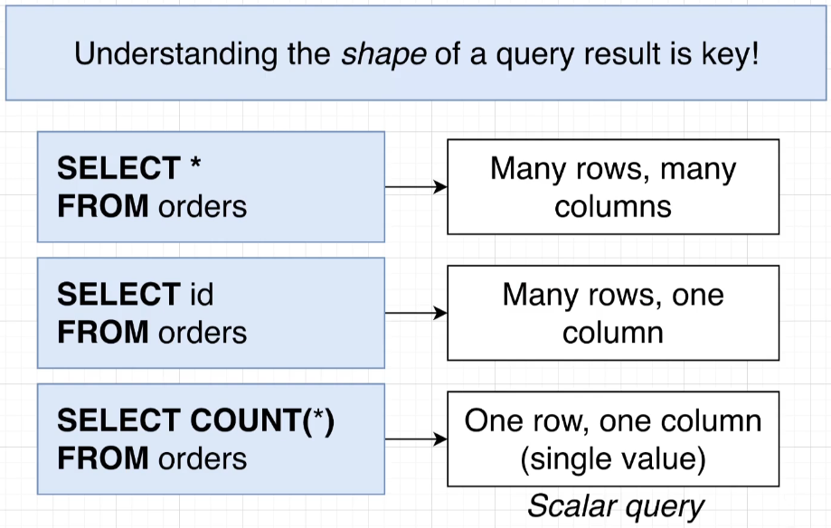
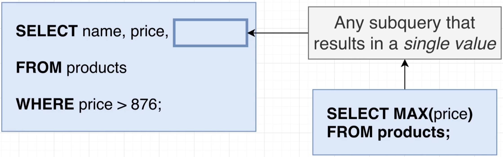
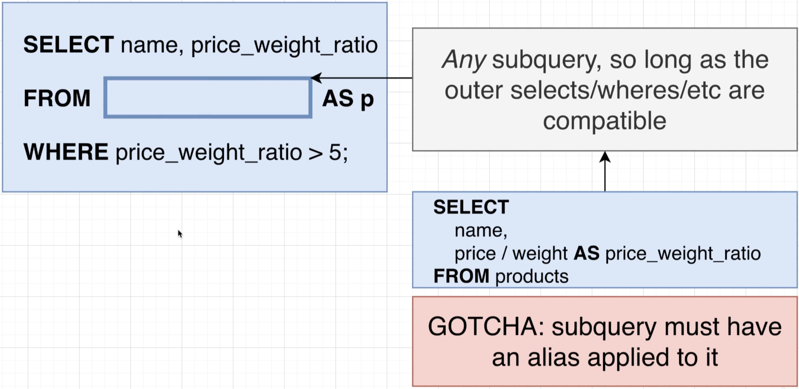
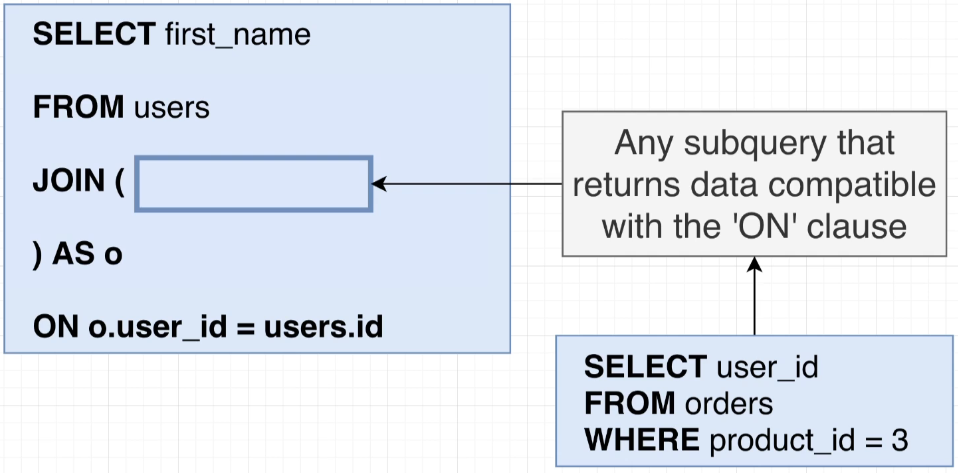
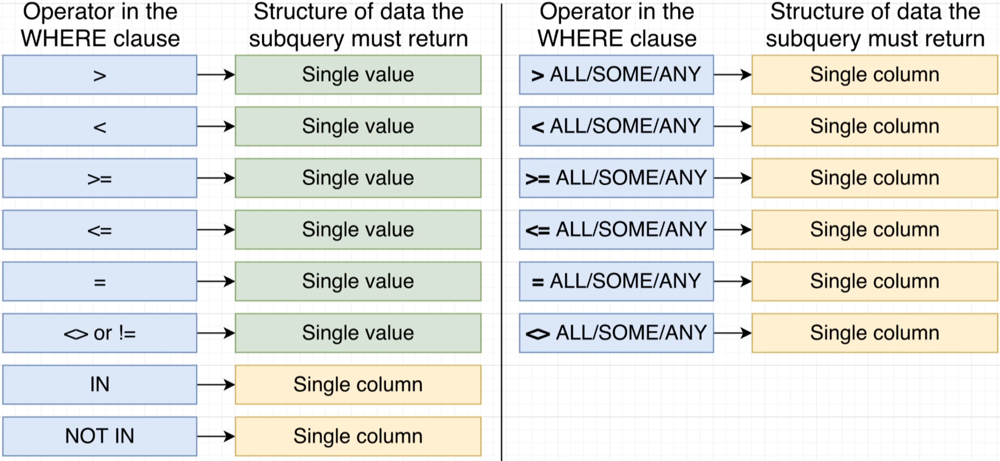
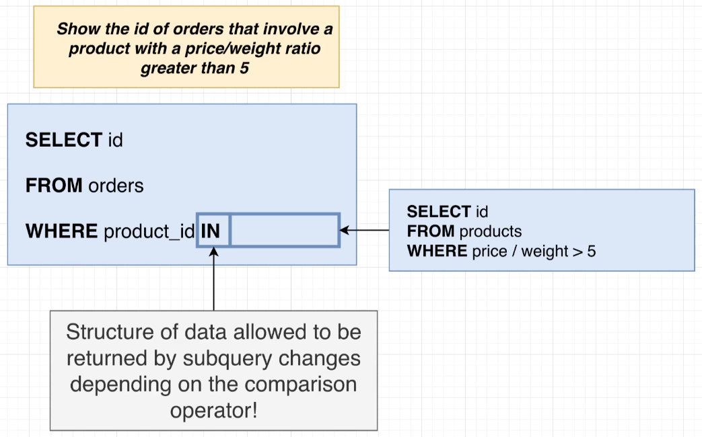

# Sub-Query

Sections:

- [`Introduction`](#introduction): Introduction to subquery in a query by using `parenthesis`.
- [`Structure of Data`](#structure-of-data): Imagining data as an object with attributes to figure out the output of data
- [`Different locations of subqueries`](#different-locations): Showing different locations that the subqueries can be written at.
  - [`SELECT`](#select)
  - [`FROM`](#from)
  - [`JOIN`](#join)
  - [`WHERE`](#where)
- [`End`](#end)

## Introduction

In this section, there will be examples on how to write subqueries.

`Format`:

```SQL
SELECT <column/s>
FROM <table>
WHERE <column> <operand> (
    SELECT <operand><column></operand>
    FROM <table>
    WHERE <column> <operand>
)
```

`Example`:

```SQL
SELECT name, price
FROM products
WHERE price > (
    SELECT MAX(price)
    FROM products
    WHERE department = 'Toys'
)
```

> We can use subqueries in different locations, not only in where keyword as shown in the example.

## Structure of Data

Here we will try to understand the `Shape of Data`.

- `SELECT *`: All rows and column
- `SELECT <column>`: Selected column and all rows.
- `SELECT COUNT(*)`: One row and column. *Scalar Query*



## Different Locations

- [`SELECT`](#select)
- [`FROM`](#from)
- [`JOIN`](#join)
- [`WHERE`](#where)


### SELECT

For subquery to be in `SELECT`, we have to ensure that the sub query only returns a *`Scalar Query(One value)`*.

*`Scalar Query`*:

`Sub Query`:

```SQL
SELECT MAX(price)
FROM products
```

`Full Query`

```SQL
SELECT name, price, (
    SELECT MAX(price)
    FROM products
    )
FROM products
WHERE price > 876
```



### FROM

For subquery to be in `FROM`:

- Must have an alias applied to it.

`Sub Query`:

```SQL
SELECT name, price_weight_ratio
FROM products
```

`Full Query`:

```SQL
SELECT name, price_weight_ratio
FROM (
    SELECT name, price / weight AS price_weight_ratio
    FROM products
) AS p
WHERE price > 876
```

`Use Case` - Finding average per user:

```SQL
SELECT AVG(p.order_count)
FROM (
    SELECT user_id, COUNT(*) AS order_count
    FROM products
    GROUP BY user_id
) AS p
```



### JOIN

For subquery to be in `JOIN`:

- Subquery must return data compatible with the `ON` clause.
- **Not really useful**.

`Sub Query`:

```SQL
SELECT user_id
FROM orders
WHERE product_id = 3
```

`Full Query`:

```SQL
SELECT first_name
FROM users
JOIN (
    SELECT user_id
    FROM orders
    WHERE product_id = 3
) AS o
ON o.user_id = users.id
```

> Not very useful and can be rewritten in a simpler form:

```SQL
SELECT first_name
FROM users
JOIN orders ON orders.user_id = users.id
WHERE orders.product_id = 3
```



### WHERE

`Sub Query`:

```SQL
SELECT id
FROM products
WHERE price / weight > 50
```

`Full Query`:

```SQL
SELECT id
FROM orders
WHERE product_id IN (
    SELECT id
    FROM products
    WHERE price / weight > 50
)
```

> You can also use a join clause instead of a subquery for this example.

### Operators for the where clause

This sub section is dedicated to the operators that can be used and what type of data structure `PGSQL` expects from the operator:

```SQL
SELECT <column>
FROM <table>
-- The Operator that is in the where clause below.
WHERE <condition_column> <*Operator*> (
    SELECT <column>
    FROM <table>
    WHERE <condition>
)
```





## End

Previous Topic: [Topic 6 - Union and Intersections](6-Union_and_Intersections_with_Sets.md)

<!-- Next Topic: [Topic -]() -->
