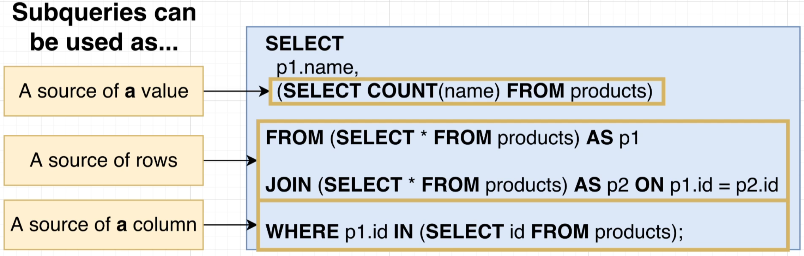

# Sub-Query

- [`Introduction`](#introduction): Introduction to subquery in a query by using `parenthesis`.
- [`Structure of Data`](#structure-of-data): Imagining data as an object with attributes to figure out the output of data
- [`Different locations of subqueries`](#different-locations): Showing different locations that the subqueries can be written at.

## Introduction

In this section, there will be examples on how to write subqueries.

`Format`:

```SQL
SELECT <column/s>
FROM <table>
WHERE <column> <operand> (
    SELECT <operand><column></operand>
    FROM <table>
    WHERE <column> <operand>
)
```

`Example`:

```SQL
SELECT name, price
FROM products
WHERE price > (
    SELECT MAX(price)
    FROM products
    WHERE department = 'Toys'
)
```

> We can use subqueries in different locations, not only in where keyword as shown in the example.

## Structure of Data

Here we will try to understand the `Shape of Data`.

- `SELECT *`: All rows and column
- `SELECT <column>`: Selected column and all rows.
- `SELECT COUNT(*)`: One row and column. *Scalar Query*


## Different Locations


