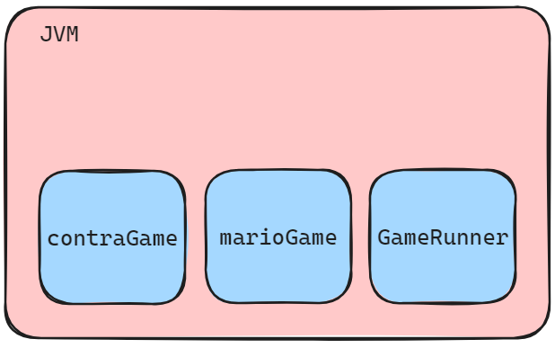
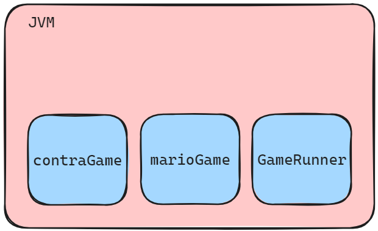

# Getting Started with Spring

This docs is for [First_Lesson](./First_Lesson/).

## Tightly Coupled

In Spring, `Tightly Coupled` application would be known as `Monolithic`. This means that we've defined a static type for the `GameRunner` Class and when we want to run another Class into the `GameRunner` constructor, we would need to change the code.

- **Coupling**: How much work is involved in changing something.
  - An `engine` is tightly coupled to a `Car`. => `Tightly Coupled`.
  - A `wheel` is loosely coupled to a `Car`. => `Loosely Coupled`.

> Coupling is **even more important** in building **great software**.

Only thing constant in **Technology** is change.
  
- Business Requirements change.
- Frameworks change.
- Code changes.

> We want **Loose Coupling** *as much as possible* as to make functional changes with *as less code changes as possible*.

---

## What we want to achieve in Spring - Objective

```Java
var game = new MarioGame();
var gameRunner = new GameRunner(game);
gameRunner.run();
```

The code above shows that:

- `game` variable is a Dependency of `GameRunner` Class:
  - We can say that the `game` variable is being `injected/wired` into the `GameRunner` Class.

> In this case, we're managing and creating our own `Dependencies`. What we're trying to achieve is to have `Spring` manage and create our `Dependencies`

Here's some illustration on what's going on:

- What we're currently doing:



- What we want to do using `Spring`:



## Java Sprinng Bean

Steps to start:

- Launch a Spring Context - On `AppHelloWorldSpring.java`:

```Java
var helloWorldContext = new AnnotationConfigApplicationContext(HelloWorldConfiguration.class);
```

- Configure things that we want Spring to manage, `@Configuration`. - On `HelloWorldConfiguration.java`:

```Java
@Configuration // Specify @Configuration
public class HelloWorldConfiguration {

    @Bean // Specify the Bean Method
    public String name(){
        return "Test Name";
    }
}
```

> `@Configuration` is a Class.

- Retrieving Beans managed by Spring:

```Java
System.out.println(helloWorldContext.getBean("name"));
helloWorldContext.close(); // Close the context once done
```
