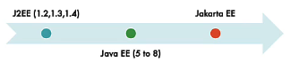

# Spring Framework Advanced Features

## Initialisation

During runtime, the default initilisation of a `Bean/Component` is `Eager`. This means that regardless of whether the `Bean/Component` is being used or not, it is being initialised during **startup**. To defer the component from being initilised, we can place the `@Lazy` annotation.

```Java
@Component
@Lazy // Use this annotation.
public class ClassB{
    // Some code
}

@Configuration
public class SomeApp{
    public static void main(String[] args){
        try(var context = new AnnotationConfigApplicationContext(SomeApp.class)){
            // The Bean will initialise at this point after AnnotationConfigApplicationContext
            context.getBean(ClassB.class);
        }
    }
}
```

> Only when we're using `ClassB`, it will then be initialised. It can be used on any `@Component` or `@Bean`

- Default initialization for Spring Beans: **Eager**.
- **Eager** initialisation is recommended:
  - Errors in the configuration are discovered immediately at application startup.
- However you can configure beans to be lazily initialised using `Lazy` annotation:
  - **Not recommended** (`AND`) **Not frequently used**.
- `Lazy` annotation:
  - Can be used almost everywhere `@Component` and `@Bean` are used.
  - Lazy-resolution proxy will be injected instead of actual dependency.
  - Can be used on Configuration (@Configuration) class.

## Eager vs Lazy Initialisation

| Heading                                          | Lazy                                                              | Eager                                            |
| ------------------------------------------------ | ----------------------------------------------------------------- | ------------------------------------------------ |
| Initialisation Time                              | Bean initialisaed when it is first made use of in the application | Bean initialisaed at startup of the application  |
| Default                                          | NOT Default                                                       | Default                                          |
| Code Snippet                                     | @Lazy OR @Lazy(value=true)                                        | @Lazy(value=false) OR (Absence of @Lazy)         |
| What happens if there are errors in initialising | Errors will result in `RunTimeException`                          | Errors will prevent application from starting up |
| Usage                                            | Rarely Used                                                       | Very frequently used                             |
| Memory Consumption                               | Less(until bean is initialised)                                   | All beans are initialised at startup             |
| Recommended Scenario                             | Beans very rarely used in your app                                | Most of your beans                               |

## Spring Beans Scopes

By default, all `Instances of a Class` is `Singleton`. Which is to say that all initialised Class is shared.
To learn more of the `Design Patterns` about `Singleton`, [click here](https://refactoring.guru/design-patterns/singleton).
To learn more of the `Design Patterns` about `Prototype`, [click here](https://refactoring.guru/design-patterns/prototype).

- Spring Beans are defined to be used in a specific scope:
  - `Singleton`: **One object instance** per Spring IoC container.
  - `Prototype`: **Possibly many object instances** per Spring IoC container.
- Scopes applicable ONLY for web-aware Spring ApplicationContext:
  - `Request`: **One object instance** per single HTTP request.
  - `Session`:**One object instance** per single HTTP session
  - `Application`: **One object instance** per single web application runtime.
  - `Websocket`: **One object instance** per single WebSocket instance.
- **Java Singleton (GOF)** vs **Spring Singleton**:
  - **Spring Singleton**: **One object instance** per single Spring IoC container.
  - **Java Singleton (GOF)**: **One object instance** per JVM.

| Heading              | Prototype                                                    | Singleton                                                               |
| -------------------- | ------------------------------------------------------------ | ----------------------------------------------------------------------- |
| Instances            | Possibly Many per Spring IoC Container                       | One per Spring IoC Container                                            |
| Beans                | New bean instance created every time the bean is referred to | Same bean instance reused                                               |
| Default              | NOT Default                                                  | Default                                                                 |
| Code Snippet         | `@Scope(value=ConfigurableBeanFactory.SCOPE_PROTOTYPE)`      | `@Scope(value=ConfigurableBeanFactory.SCOPE_SINGLETON)` OR (By Default) |
| Usage                | Rarely Used                                                  | Very frequently used                                                    |
| Recommended Scenario | Stateful beans                                               | Stateless beans                                                         |

### Prototype

Unlike `Singleton`, `Prototype` will create different instance of a Class every time a **Spring Bean** is called.

We can specify the `Prototype` Annotation by:

```Java
@Scope(value="prototype")
@Component
//Or
@Scope(value=ConfigurableBeanFactory.SCOPE_PROTOTYPE)
@Component
```

### PreDestroy and PostConstruct

We can initialise a method after the dependencies are being wired/injected. For this, we're going to use `@PostConstruct`.

We can call a method before an application is terminated or when the Bean is removed from context. For this, we would be using `PreDestroy`.

```Java
@Component
class SomeClass{
  private SomeDependency someDependency;
  public SomeClass(SomeDependency someDependency){
    this.someDependency = someDependency;
  }

  @PostConstruct // This method will run after the constructor injection.
  public void intialise(){
    someDependency.doSomething();
  }

  @PreDestroy // This method will execute just before the application stops.
  public void cleanup(){
    someDependency.doCleanup();
  }
}

@Component
class SomeDependency {

  public void doSomething(){
    System.out.println("Start Initilisation");
  }

  public void doCleanup(){
    System.out.println("Clean up");
  }

}
```

> The `doSomething` method will run immediately after the all the dependencies are wired/injected into the constructor.
> The use case for `PostConstruct` would be fetching the data from the Database after dependencies are being wired/injected.
> The use case for `PreDestroy` would be closing active connections because the Beans are being removed from the **Spring Container** or `ApplicationContext`.

## J2EE vs Java EE vs Jakarta EE



- Enterprise capabilities were **initially built into JDK**.
- With time, they were separated out:
  - **J2EE**: Java 2 Platform Enterprise Edition.
  - **Java EE**: Java Platfrom Enterprpise Edition.
  - **Jarkarta EE** (Oracle gave Java EE rights to the Eclipse Foundation)
    - **Important Specifications**:
      - `JSP`: Jakarta Server Pages
        - Create `views` in web applications.
      - `JSTL`: Jakarta Standard Tag Library
        - Tag Libraries to show dynamic information for webpages.
      - `EJB`: Jakarta Enterprise Beans
      - `JAX-RS`: Jakarta RESTful Web Services
        - REST Service.
      - Jakarta Bean Validation
      - `CDI`: Jakarta Contexts and Dependency Injection
        - Specifications on how to do `Dependency Injection`.
      - `JPA`: Jakarta Persistence API
    - Supported by **Spring 6** and **Spring Boot 3**.
      - Uses `jakarta` packages instead of `javax`.

### Jakarta Contexts and Dependency Injection

- CDI is a specification(interface)
  - **Spring Framework** implements `CDI`.
- Important Inject API Annotations:
  - `Inject`: Similar to `@Autowired` in **Spring**.
  - `Named`: Similar to `@Component` in **Spring**.
  - `Qualifier`: Similar to `@Qualifier` in **Spring**.
  - `Scope`: Similar to `@Scope` in **Spring**.
  - `Singleton`: Similar to `@Scope(value=ConfigurableBeanFactory.SCOPE_SINGLETON)` in **Spring**.

To add use `CDI`, we would edit it in the `pom.xml`:

```html
<dependency>
  <groupId>jakarta.inject</groupId>
  <artifactId>jakarta.inject-api</artifactId>
  <version>2.0.1</version> <!-- Check for the versions before adding in-->
</dependency>
```

**CDI** is an alternative to **Spring Framework CDI**.

```Java
// @Component
@Named
class BusinessService{
  private DataService dataService;

  // @Autowired
  @Inject
  public void setDataService(DataService dataService){
    this.dataService = dataService;
  }

  public DataService getDataService(){
    return this.dataService;
  }
}

// @Component
@Named
class DataService{

}

@Configuration
class App{
  public static void main(String[] args){
    try(var context = new AnnotationConfigApplicationContext(App.class)){
      context.getBean(BusinessService.class);
    }
  }
}
```

## Spring XML Configuration

In the past, we used a `Java Annotation` to create a context:

```Java
var context = new AnnotationConfigApplicationContext(App.class);
```

Spring used to have XML Aplication Context instead.

- In the `/src/main/resources`, create a file `contextConfiguration.xml`.
- Google for **Spring XML Configuration** and should lead you to [this page](https://docs.spring.io/spring-framework/docs/4.2.x/spring-framework-reference/html/xsd-configuration.html) equivalent.
- `CTRL + F` for `context schema`.
- Copy and paste the XML configuration into `contextConfiguration.xml`.
- Now instead of `AnnotationConfigApplicationContext`, we would use `ClassPathXmlApplicationContext`:

`XML` for context schema:

```XML
<?xml version="1.0" encoding="UTF-8"?>
<beans xmlns="http://www.springframework.org/schema/beans"
    xmlns:xsi="http://www.w3.org/2001/XMLSchema-instance"
    xmlns:context="http://www.springframework.org/schema/context" xsi:schemaLocation="
        http://www.springframework.org/schema/beans http://www.springframework.org/schema/beans/spring-beans.xsd
        http://www.springframework.org/schema/context http://www.springframework.org/schema/context/spring-context.xsd"> <!-- bean definitions here -->

</beans>
```

```Java
// @Configuration and @ComponentScan are not needed
public class App{
  try(var context = new ClassPathXmlApplicationContext("contextConfiguration.xml")){

  }
}
```

### Adding additional beans for XML Configuration

We can add beans by configuring the XML file with the `<bean></bean>` tag:

```XML
<?xml version="1.0" encoding="UTF-8"?>
<beans xmlns="http://www.springframework.org/schema/beans"
    xmlns:xsi="http://www.w3.org/2001/XMLSchema-instance"
    xmlns:context="http://www.springframework.org/schema/context" xsi:schemaLocation="
        http://www.springframework.org/schema/beans http://www.springframework.org/schema/beans/spring-beans.xsd
        http://www.springframework.org/schema/context http://www.springframework.org/schema/context/spring-context.xsd"> <!-- bean definitions here -->

        <!--Beans-->
        <bean id="name" class="java.lang.String">
          <constructor-arg value="Strava"/>
        </bean>

        <bean id="age" class="java.lang.Integer">
          <constructor-arg value="69"/>
        </bean>

        <!--Component Scan-->
        <context:component-scan
          base-package="com.second.learn_another.game"/>

        <!--Creating instance instead of Component Scan-->
        <bean id="game" class="com.second.learn_another.game.Pacman">
        </bean>

        <bean id="gameRunner" class="com.second.learn_another.game.GameRunner">
          <constructor-arg ref="game"/>
        </bean>

</beans>
```

| Heading              | Java Annotations                               | XML Configuration           |
| -------------------- | ---------------------------------------------- | --------------------------- |
| Ease of Use          | Very Easy                                      | Cumbersome                  |
| Short and Concise    | Yes                                            | No                          |
| Clean POJOs          | No. POJOs are polluted with Spring Annotations | Yes. No change in Java code |
| Easy to Maintain     | Yes                                            | No                          |
| Usage Frequency      | Almost all recent projects                     | Rarely                      |
| Debugging Difficulty | Hard                                           | Medium                      |
| Recommendation       | Either of them is fine **BUT** be consistent   | Do **NOT** mix both         |
