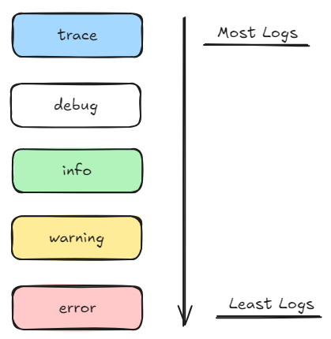

# Getting Started with Spring Boot

---

## Why use Spring Boot

The main reason to use Spring Boot is to build **Production-Ready** applications **Quickly**.

- **Quickly**:
  - [Spring Initializr](https://start.spring.io/).
  - Spring Boot Starter Projects.
  - Spring Boot Auto Configuration.
  - Spring Boot DevTools.
- **Production-Ready**:
  - Logging.
  - Different Configuration for Different Environments.
    - Profiles, ConfigurationProperties.
  - Monitoring (Spring Boot Actuator).

## Exploring Spring Boot Starter Projects

To build an applications, we would need a lot of framework to work together:

- Build a `REST API`: Spring, Spring MVC, Tomcat, JSON conversion...
- Write Unit Tests: Spring Test, JUnit, Mockito...

Grouping them and make it easy to build applications:

- **Starters**: Convenient dependency descriptors for different features

**Spring Boot** provides variety of starter projects:

- **Web App** & `REST API`
  - **`Spring Boot Starter Web`**:
    - spring-webmvc
    - spring-web
    - spring-boot-starter-tomcat
    - spring-boot-starter-json
  - **`Unit Tests`**:
    - **Spring Boot Starter Test**
  - **Talk to database using `JPA`**
    - Spring Boot Starter Data JPA.
  - **Talk to database using `JDBC`**
    - Spring Boot Starter JDBC.
  - Secure **Web Applications** or `REST API`:
    - Spring Boot Starter Security.

## Auto Configuration during startup

What we can do to see what was auto-configured for you is within the file in `/src/main/resources/` there is a file name `application.properties`. Add a line in the file:

```properties
logging.level.org.springframework=debug
```

Restart the applications and within the terminal, there will be information about which packages are started.

During startup, a Spring Boot Starter Web would start up:

- **Dispatcher Servlet** (`DispatcherServletAutoConfiguration`)
- **Embedded Servlet Container** - Tomcat is the default (`EmbeddedWebServerFactoryCustomizerAutoConfiguration`)
- **Default Error Pages** (`ErrorMvcAutoConfiguration`)
- **Bean <-> JSON** (`JacksonHttpMessageConvertersConfiguration`)

There are different logging levels and base on what's specified, the amount of logging will be logged in the terminal:

- trace
- debug
- info
- warning
- error



> Logs will log from top to bottom. This means if you use `trace`, it will log all the logs. If you use `info`, it will only log from info to error.

## Spring Boot DevTools

What if we want our web application, during development to use live-reloading like [Air](https://github.com/air-verse/air) for `Golang`?

Here's where we use **Spring Boot Devtools**. For us to use the **Spring Boot DevTools**, we would start by editing the `pom.xml` of the project to add:

```xml
<dependency>
 <groupId>org.springframework.boot</groupId>
 <artifactId>spring-boot-devtools</artifactId>
</dependency>
```

Then restart the server.
This is make the changes live every time there is a change in the code and when you refresh the webpage.

## Production Ready for Spring Boot

### Profiles

Applications have different environments:

- Dev
- QA
- Stage
- Prod

Different environments need different configuration:

- Different Databases in each environment.
- Different Web Services in each environment.

To configure profiles in Spring Boot, we would need to add a line in the `/src/main/resources/application.properties` file:

```properties
spring.profiles.active=<stage>

# Example
spring.profiles.active=prod
```

Make sure to make files for the profiles within the folder like:

- Production Environment - `prod`: `application-prod.properties`
- Development Environment - `dev`: `application-dev.properties`

### ConfigurationProperties

If we want to have a little bit more customisable configurations, we can create a `Java Class` and use `ConfigurationProperties` Annotation.

- `Example` - `CurrencyServiceConfiguration`:

```Java
@ConfigurationProperties(prefix = "currency-service")
@Component
public class CurrencyServiceConfiguration {
    private String url;
    private String username;
    private String key;

    // Getter
    public String getUrl() {
        return url;
    }

    public String getKey() {
        return key;
    }

    public String getUsername() {
        return username;
    }

    // Setter
    public void setUrl(String url) {
        this.url = url;
    }

    public void setKey(String key) {
        this.key = key;
    }

    public void setUsername(String username) {
        this.username = username;
    }

}
```

- `Example` - `application.properties`:

```properties
currency-service.url=http://default.something.com
currency-service.username=defaultUsername
currency-service.key=defaultKey
```
